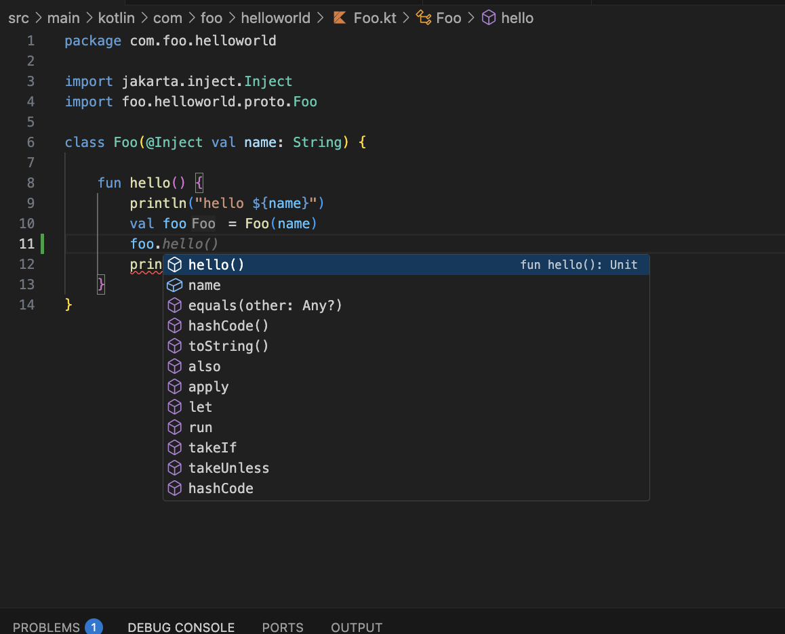

# bazel-kotlin-vscode-extension README
[![Bazel][bazel-img]][bazel-url] [![Kotlin][kotlin-img]][kotlin-url] [![VSCode][vscode-img]][vscode-url]

[bazel-img]: https://img.shields.io/badge/build%20with-Bazel-43A047.svg
[bazel-url]: https://bazel.build
[kotlin-img]: https://img.shields.io/badge/kotlin-%237F52FF.svg?style=flat&logo=kotlin&logoColor=white
[kotlin-url]: https://kotlinlang.org
[vscode-img]: https://img.shields.io/badge/VSCode-0078D4?style=flat&logo=visual%20studio%20code&logoColor=white
[vscode-url]: https://code.visualstudio.com

This lightweight extension is used to "sync" the Bazel project with the Kotlin language server. This takes inspiration from the [Kotlin](https://github.com/fwcd/vscode-kotlin) but is focused on the [fork](https://github.com/smocherla-brex/kotlin-language-server-bazel-support) of the language server with bazel support. A lot of the implementation is based on the [Kotlin extension](https://github.com/fwcd/vscode-kotlin) but customized to support Bazel.

## Features

- Automatically download the language server and keep it up to date.
- Partially sync Bazel packages on demand, build and notify the language server with updated bazel classpath.
- Completions
- Support for Goto-Definition for most usecases.
- Hover support to show docstrings in some cases.
- VSCode test explorer integration for kotest based `DescribeSpec` tests.

## Usage

- Right-click on a directory and select "Bazel KLS Sync". This will trigger a bazel build and activate the language server.

- You can follow the output in a `Bazel KLS Sync` output channel.
- Once the build completes, the classpath in the LSP gets updated and the files are analyzed for syntax highlighting and other features.

### VSCode Test Explorer Integration
If you use the popular Kotlin testing framework [Kotest](https://github.com/kotest/kotest), you can leverage the VS Code test explorer integration to view and run tests. You can see how it looks from below.

Note that your test runner needs to support `--test_filter` to run single tests or suites with Bazel. By default it'll run all tests in the test class with bazel.

## Example
You can try the extension out on [this](https://github.com/smocherla-brex/bazel-kls-example) repo to find out how it works.

## Contributing
Please check existing [Github issues](https://github.com/smocherla-brex/bazel-kotlin-vscode-extension/issues) if you have a feature request or a bug.

### Development
Working on changes scoped to just the extension should be fairly straightforward following the VSCode [guides](https://code.visualstudio.com/api/extension-guides/overview).

If you're trying to integrate changes to the language server into the extension and test it end-to-end, please follow instructions [here](https://github.com/smocherla-brex/kotlin-language-server-bazel-support/blob/main/DEVELOPMENT.md).

## TODO

- [ ] Some more performance improvements to the completions.
- [ ] Improve performance with large files and especially with growing symbol index.
- [ ] Debugger support

## Configuration options

- `bazelKLS.enabled`: Whether to enable the language server.
- `bazelKLS.languageServerVersion`: The version of the language server to use. Defaults to `v1.3.14-bazel` for now.
- `bazelKLS.jvmOpts`: The JVM options to use when starting the language server.
- `bazelKLS.buildFlags`: The bazel flags to be passed to the `bazel build` command during a sync.
