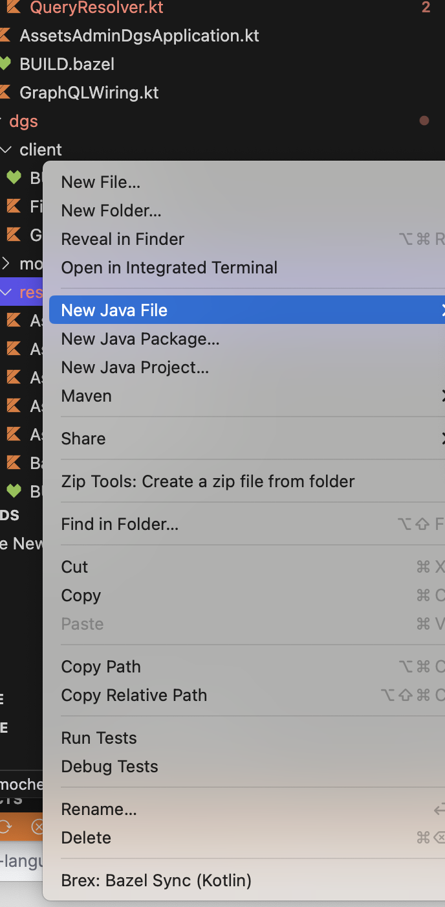

# bazel-kotlin-vscode-extension README
[![Bazel][bazel-img]][bazel-url] [![Kotlin][kotlin-img]][kotlin-url] [![VSCode][vscode-img]][vscode-url]

[bazel-img]: https://img.shields.io/badge/build%20with-Bazel-43A047.svg
[bazel-url]: https://bazel.build
[kotlin-img]: https://img.shields.io/badge/kotlin-%237F52FF.svg?style=flat&logo=kotlin&logoColor=white
[kotlin-url]: https://kotlinlang.org
[vscode-img]: https://img.shields.io/badge/VSCode-0078D4?style=flat&logo=visual%20studio%20code&logoColor=white
[vscode-url]: https://code.visualstudio.com

This lightweight extension is used to "sync" the Bazel project with the Kotlin language server. 

## Features

- Automatically download the language server and keep it up to date.
- Partially sync Bazel packages on demand, build and notify the language server.
- Support for Goto-Definition for firsty-party (brex) and third-party libraries through source jars.

## Usage

Right-click on a directory and select "Brex: Bazel Sync (Kotlin)". This will trigger a bazel build and activate the language server.

## TODO

- [ ] Add hover support to show docstrings.
- [ ] Single-test support to run tests.
- [ ] Some more performance improvements to the completions.
- [ ] Release pipeline and version the extension.

