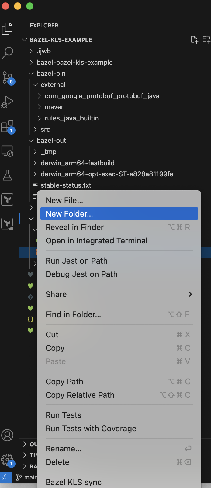

# bazel-kotlin-vscode-extension README
<!-- VS Code Marketplace -->
[](https://marketplace.visualstudio.com/items?itemName=SridharMocherla.bazel-kotlin-vscode-extension)
[](https://marketplace.visualstudio.com/items?itemName=SridharMocherla.bazel-kotlin-vscode-extension)
[-yellow?logo=visual-studio-code)](https://marketplace.visualstudio.com/items?itemName=SridharMocherla.bazel-kotlin-vscode-extension)

<!-- Open VSX Registry -->
[](https://open-vsx.org/extension/SridharMocherla/bazel-kotlin-vscode-extension)
[](https://open-vsx.org/extension/SridharMocherla/bazel-kotlin-vscode-extension)
[](https://open-vsx.org/extension/SridharMocherla/bazel-kotlin-vscode-extension)

This lightweight extension is used to "sync" the Bazel project with the Kotlin language server. This takes inspiration from the [Kotlin](https://github.com/fwcd/vscode-kotlin) extension but is focused on the [fork](https://github.com/smocherla-brex/kotlin-language-server-bazel-support) of the language server with bazel support. A lot of the implementation is based on the [Kotlin extension](https://github.com/fwcd/vscode-kotlin) but customized to support Bazel.

Additionally it also relies on a fork of [Kotlin Debug Adapter](https://github.com/fwcd/kotlin-debug-adapter) customized to support Bazel.

## Features

- Automatically download the language server and keep it up to date.
- Partially sync Bazel packages on demand, build and notify the language server with updated bazel classpath.
- Completions
- Quick fixes/Auto imports
- Support for Goto-Definition for most usecases.
- Hover support to show docstrings in some cases.
- VSCode test explorer integration for kotest based `DescribeSpec` tests.
- Experimental Debugging support with launch configuration
- Indexing optimized for bazel through pre-computing source/jar metadata during build.
- Support for lazy compilation to improve performance.

## Usage

- Right-click on a directory and select "Bazel KLS Sync". This will trigger a bazel build and activate the language server.


- You can follow the output in a `Bazel KLS Sync` output channel.
- Once the build completes, the classpath in the LSP gets updated and the files are analyzed for syntax highlighting and other features.
- Note: You can stop the sync at any time by running `Bazel KLS Sync: Stop Running Build` command from the command palette or clicking the stop button in the status bar.


### VSCode Test Explorer Integration
If you use the popular Kotlin testing framework [Kotest](https://github.com/kotest/kotest), you can leverage the VS Code test explorer integration to view and run tests. You can see how it looks from below.


Note that your test runner needs to support `--test_filter` to run single tests or suites with Bazel. By default it'll run all tests in the test class with bazel.

### Lazy Compilation

In the original implementation, the LSP would try to compile all the source files in the workspace to compute the module descriptors and the PSI represenation of the source files. In a large repo involving thousands of source files, this may lead to very high resource usage and the initial sync could be significantly slow. With our bazel sync implementation, we pre-compute a lot of things in the `bazel build` through an aspect, so it becomes redundant to do so again in the LSP for all files. So we can opt to just do "lazy" compliation but still get the full symbol index through the classpath from the build. The lazy/on-demand compilation mode is enabled by default. It can be disabled with the following configuration option:
```
bazelKLS.lazyCompilation: false
```

When lazy compilation is enabled, the LSP will only compile the files that are open initially. When symbols in other files are referenced through `Go-to-definition`, compilation of those files is triggered so as to support navigation. The LSP will still index all the symbols globally after the first Bazel sync, so you still get the benefits of completions and quick fixes even though we don't compile everything. 

### Debugging
You can now debug using a customized implementation of [Kotlin Debug Adapter](https://github.com/fwcd/kotlin-debug-adapter) using a launch configuration. This is currently experimental.

First enable the debug adapter with
```
bazelKLS.debugAdapter.enabled: true
```

and reload VSCode. It should download the debug adapter and activate it. Then you can create a launch configuration which will be something like

```
 {
        "type": "kotlin",
        "name": "Launch Kotlin with Bazel",
        "request": "launch",
        "bazelTarget": "<the binary target - typically java_binary or kt_jvm_test>",
        "mainClass": "<the main class>",
        "workspaceRoot": "${workspaceFolder}",
        "additionalArgs": [<Arguments you want to pass to the main class>],
        "vmArguments": "<Arguments you want to pass to the JVM>",
        "envVars": {
            // Any env vars you need 
        }
    }
```

And then you can use the Debug console to launch and debug the bazel target.

## Requirements
- Bazel 6/7 tested, bzlmod support is not yet tested.
- Java 11/17 tested/supported.
- Tested with Kotlin 1.9, rules_kotlin 1.9.0 (newer/older versions may work but are not tested).
- For source jars and external dependencies, require using `rules_jvm_external` with `fetch_sources` set to `True`.


## Example
You can try the extension out on [this](https://github.com/smocherla-brex/bazel-kls-example) repo to find out how it works.

## Contributing
Please check existing [Github issues](https://github.com/smocherla-brex/bazel-kotlin-vscode-extension/issues) if you have a feature request or a bug.

### Development
Working on changes scoped to just the extension should be fairly straightforward following the VSCode [guides](https://code.visualstudio.com/api/extension-guides/overview).

If you're trying to integrate changes to the language server into the extension and test it end-to-end, please follow instructions [here](https://github.com/smocherla-brex/kotlin-language-server-bazel-support/blob/main/DEVELOPMENT.md).


## Relevant Configuration options

- `bazelKLS.enabled`: Whether to enable the language server.
- `bazelKLS.jvmOpts`: The JVM options to use when starting the language server.
- `bazelKLS.buildFlags`: The bazel flags to be passed to the `bazel build` command during a sync.
- `bazelKLS.debugAdapter.enabled`: Whether to enable the debug adapter or not.
- `bazelKLS.lazyCompilation`: Whether to enable lazy/on-demand compilation.

